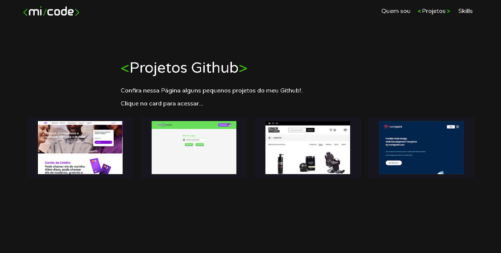

<p align="center">
  
</p>

<h1 align="center">
  📰 Meu Portfólio
</h1>

<p align="center">
  <a href="#-projeto">Projeto</a>&nbsp;&nbsp;&nbsp;|&nbsp;&nbsp;&nbsp;
  <a href="#-tecnologias">Tecnologias</a>&nbsp;&nbsp;&nbsp;|&nbsp;&nbsp;&nbsp;
  <a href="#-executando-o-projeto">Executando o projeto</a>&nbsp;&nbsp;&nbsp;|&nbsp;&nbsp;&nbsp;
  <a href="#-professor(a)">Desenvolvedor</a>
</p>

<p align="center">
  
  
  
  
  
</p>

## :computer: Projeto


<h4 align="center"><a href="https://mi-code.vercel.app/">Clique aqui para ver o projeto</a></h4>

## 📌 Seções
Site composto por 3 seções:

- **Quem sou:** Descrição falando um pouco sobre quem sou;
- **Projetos:** Alguns projetos desenvolvidos com link direto para o projeto em funcionamento;
- **Skills:** Minhas Skills em algumas Stacks com foco em Front-end;

---

## :rocket: Tecnologias utilizadas
Esse projeto foi desenvolvido com a seguinte tecnologia e suas dependencias:

--ReactJS
    --react-bootstrap
    --react-helmet-async
    --react-moment
    --react-router-dom
    --react-transition-group
    --styled-components

## :arrow_forward: Executando o projeto

#### Clone o repositório usando o seguinte comando ou baixe

```
git clone https://github.com/micheldslive/micode.git
```

#### Para instalar as dependências

```
yarn install
```

#### Para iniciar o servidor

```
yarn start
```

#### Para construção de produção

```
yarn build
```

O servidor estará disponível no http://127.0.0.1:3000 em seu navegador

## 💘 Desenvolvedor<br>
<table>
  <tr>
    <td align="center">
      <a href="https://github.com/micheldslive">
        <br>
        <sub>
          <b>Michel Domingos</b>
        </sub>
      </a>
    </td>
  </tr>
</table>